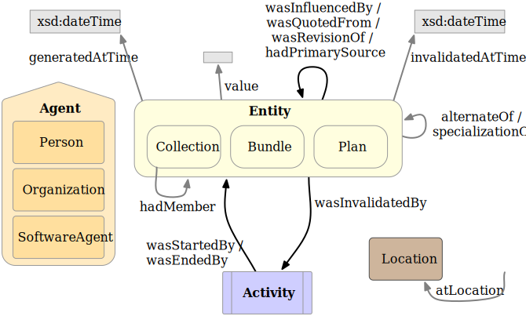

[mdp] <https://mdld.js.org/prov/>

## Expanded Terms {=mdp:categories#expanded .Container .mdp:Category label}

> The terms introduced in this section provide additional ways to describe the provenance among Entities, Activities, and Agents. The additional terms are illustrated in the following figure and can be separated into five different categories. {comment}

The first category extends the Starting Point terms with subclasses, subproperties, and a superproperty.

3 sub-classes of Agent: {!prov:category}

- Person {=prov:Person}
- Organization {=prov:Organization}
- SoftwareAgent {=prov:SoftwareAgent}

3 sub-classes of Entity: {!prov:category}

- Bundle {=prov:Bundle}
- Collection {=prov:Collection}
- EmptyCollection {=prov:EmptyCollection}
- Plan {=prov:Plan}

And Location: {!prov:category}
- Location {=prov:Location}

15 properties: {!prov:category}

- alternateOf {=prov:alternateOf}
- atLocation {=prov:atLocation}
- generated {=prov:generated}
- generatedAtTime {=prov:generatedAtTime}
- hadMember {=prov:hadMember}
- hadPrimarySource {=prov:hadPrimarySource}
- influenced {=prov:influenced}
- invalidated {=prov:invalidated}
- invalidatedAtTime {=prov:invalidatedAtTime}
- specializationOf {=prov:specializationOf}
- value {=prov:value}
- wasEndedBy {=prov:wasEndedBy}
- wasInvalidatedBy {=prov:wasInvalidatedBy}
- wasQuotedFrom {=prov:wasQuotedFrom}
- wasRevisionOf {=prov:wasRevisionOf}
- wasStartedBy {=prov:wasStartedBy}
