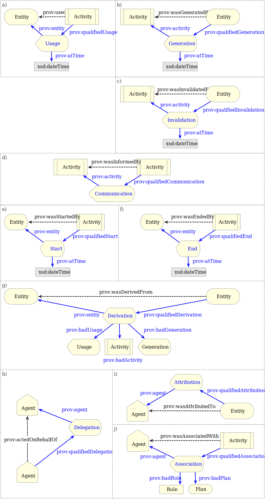

[mdp] <https://mdld.js.org/prov/>

# Qualified Terms {=mdp:categories#qualified .mdp:Category label}

The Qualified Terms category is the result of applying the Qualification Pattern [LD-Patterns-QR] to the simple (unqualified) relations available in the Starting Point and Expanded categories. The terms in this category are for users who wish to provide further details about the provenance-related influence among Entities, Activities, and Agents.

The Qualification Pattern restates an unqualified influence relation by using an intermediate class that represents the influence between two resources. This new instance, in turn, can be annotated with additional descriptions of the influence that one resource had upon another. The following two tables list the influence relations that can be qualified using the Qualification Pattern, along with the properties used to qualify them. For example, the second row of the first table indicates that to elaborate how an prov:Activity prov:used a particular prov:Entity, one creates an instance of prov:Usage that indicates the influencing entity with the prov:entity property. Meanwhile, the influenced prov:Activity indicates the prov:Usage with the property prov:qualifiedUsage. The resulting structure that qualifies the an Activity's usage of an Entity is illustrated in Figure 4a below. 

includes: {!prov:category}

- ActivityInfluence {=prov:ActivityInfluence}
- AgentInfluence {=prov:AgentInfluence}
- Association {=prov:Association}
- Attribution {=prov:Attribution}
- Communication {=prov:Communication}
- Delegation {=prov:Delegation}
- Derivation {=prov:Derivation}
- End {=prov:End}
- EntityInfluence {=prov:EntityInfluence}
- Generation {=prov:Generation}
- Influence {=prov:Influence}
- InstantaneousEvent {=prov:InstantaneousEvent}
- Invalidation {=prov:Invalidation}
- Plan {=prov:Plan}
- PrimarySource {=prov:PrimarySource}
- Quotation {=prov:Quotation}
- Revision {=prov:Revision}
- Role {=prov:Role}
- Start {=prov:Start}
- Usage {=prov:Usage}

includes: {!prov:category}

- activity {=prov:activity}
- agent {=prov:agent}
- atTime {=prov:atTime}
- entity {=prov:entity}
- hadActivity {=prov:hadActivity}
- hadGeneration {=prov:hadGeneration}
- hadPlan {=prov:hadPlan}
- hadRole {=prov:hadRole}
- hadUsage {=prov:hadUsage}
- influencer {=prov:influencer}
- qualifiedAssociation {=prov:qualifiedAssociation}
- qualifiedAttribution {=prov:qualifiedAttribution}
- qualifiedCommunication {=prov:qualifiedCommunication}
- qualifiedDelegation {=prov:qualifiedDelegation}
- qualifiedDerivation {=prov:qualifiedDerivation}
- qualifiedEnd {=prov:qualifiedEnd}
- qualifiedGeneration {=prov:qualifiedGeneration}
- qualifiedInfluence {=prov:qualifiedInfluence}
- qualifiedInvalidation {=prov:qualifiedInvalidation}
- qualifiedPrimarySource {=prov:qualifiedPrimarySource}
- qualifiedQuotation {=prov:qualifiedQuotation}
- qualifiedRevision {=prov:qualifiedRevision}
- qualifiedStart {=prov:qualifiedStart}
- qualifiedUsage {=prov:qualifiedUsage}
- wasInfluencedBy {=prov:wasInfluencedBy}

----

Seven Starting Point relations can be further described using the Qualification Pattern. They are listed in the following normative table.
Table 2: Qualification Property and Qualified Influence Class used to qualify a Starting-point Property. Influenced Class 	Unqualified Influence 	Influencing Class 	Qualification Property 	Qualified Influence 	Influencer Property
prov:Entity 	prov:wasGeneratedBy 	prov:Activity 	prov:qualifiedGeneration 	prov:Generation 	prov:activity
prov:Entity 	prov:wasDerivedFrom 	prov:Entity 	prov:qualifiedDerivation 	prov:Derivation 	prov:entity
prov:Entity 	prov:wasAttributedTo 	prov:Agent 	prov:qualifiedAttribution 	prov:Attribution 	prov:agent
prov:Activity 	prov:used 	prov:Entity 	prov:qualifiedUsage 	prov:Usage 	prov:entity
prov:Activity 	prov:wasInformedBy 	prov:Activity 	prov:qualifiedCommunication 	prov:Communication 	prov:activity
prov:Activity 	prov:wasAssociatedWith 	prov:Agent 	prov:qualifiedAssociation 	prov:Association 	prov:agent
prov:Agent 	prov:actedOnBehalfOf 	prov:Agent 	prov:qualifiedDelegation 	prov:Delegation 	prov:agent

Seven Expanded relations can be further described using the Qualification Pattern. They are listed in the following normative table.
Table 3: Qualification Property and Qualified Influence Class used to qualify an Expanded Property. Influenced Class 	Unqualified Influence 	Influencing Class 	Qualification Property 	Qualified Influence 	Influencer Property
prov:Entity or prov:Activity or prov:Agent 	prov:wasInfluencedBy 	prov:Entity or prov:Activity or prov:Agent 	prov:qualifiedInfluence 	prov:Influence 	prov:influencer
prov:Entity 	prov:hadPrimarySource 	prov:Entity 	prov:qualifiedPrimarySource 	prov:PrimarySource 	prov:entity
prov:Entity 	prov:wasQuotedFrom 	prov:Entity 	prov:qualifiedQuotation 	prov:Quotation 	prov:entity
prov:Entity 	prov:wasRevisionOf 	prov:Entity 	prov:qualifiedRevision 	prov:Revision 	prov:entity
prov:Entity 	prov:wasInvalidatedBy 	prov:Activity 	prov:qualifiedInvalidation 	prov:Invalidation 	prov:activity
prov:Activity 	prov:wasStartedBy 	prov:Entity 	prov:qualifiedStart 	prov:Start 	prov:entity
prov:Activity 	prov:wasEndedBy 	prov:Entity 	prov:qualifiedEnd 	prov:End 	prov:entity

The qualification classes and properties shown in the previous two tables can also be found in the normative cross reference in the next section of this document. All influence classes (e.g. prov:Association, prov:Usage) are extensions of prov:Influence and either prov:EntityInfluence, prov:ActivityInfluence, or prov:AgentInfluence, which determine the property used to cite the influencing resource (either prov:entity, prov:activity, or prov:agent, respectively). Because prov:Influence is a broad relation, its most specific subclasses (e.g. prov:Communication, prov:Delegation, prov:End, prov:Revision, etc.) should be used when applicable.

Example 6:

For example, given the unqualified statement:

:e1 
   a prov:Entity;
   prov:wasGeneratedBy :a1;
.

:a1 a prov:Activity .

One can find that prov:wasGeneratedBy can be qualified using the qualification property prov:qualifiedGeneration, the class prov:Generation (a subclass of prov:ActivityInfluence), and the property prov:activity. From this, the influence relation above can be restated with the qualification pattern as:

Example 7:

:e1 
   a prov:Entity;
   prov:wasGeneratedBy      :a1;
   prov:qualifiedGeneration :e1Gen; # Add the qualification.
.

:e1Gen 
   a prov:Generation;
   prov:activity            :a1;    # Cite the influencing Activity.
   ex:foo                   :bar;   # Describe the Activity :a1's influence upon the Entity :e1.
.

:a1 a prov:Activity .

The asserter can thus attach additional properties to :e1Gen to describe the generation of :e1 by :a1.

As can be seen in this example, qualifying an influence relation provides a second form (e.g. :e1 prov:qualifiedGeneration :e1Gen) to express an equivalent influence relation (e.g. :e1 prov:wasGeneratedBy :a1). It is correct and acceptable for an implementer to use either qualified or unqualified forms as they choose (or both), and a consuming application should be prepared to recognize either form. Consuming applications should recognize both qualified and unqualified forms, and treat the qualified form as implying the unqualified form. Because the qualification form is more verbose, the unqualified form should be favored in cases where additional properties are not provided. When the qualified form is expressed, including the equivalent unqualified form can facilitate PROV-O consumption, and is thus encouraged.

In addition to the previous two tables, Figure 4 illustrates the classes and properties needed to apply the qualification pattern to ten of the fourteen qualifiable influence relations. For example, while prov:qualifiedUsage, prov:Usage, and prov:entity are used to qualify prov:used relations, prov:qualifiedAssociation, prov:Association, and prov:agent are used to qualify prov:wasAssociatedWith relations. This pattern applies to the twelve other influence relations that can be qualified.

In subfigure a the prov:qualifiedUsage property parallels the prov:used property and references an instance of prov:Usage, which in turn provides attributes of the prov:used relation between the Activity and Entity. The prov:entity property is used to cite the Entity that was used by the Activity. In this case, the time that the Activity used the Entity is provided using the prov:atTime property and a literal xsd:dateTime value. The prov:atTime property can be used to describe any prov:InstantaneousEvent (including prov:Start, prov:Generation, prov:Usage, prov:Invalidation, and prov:End).

Similarly in subfigure j, the prov:qualifiedAssociation property parallels the prov:wasAssociatedWith property and references an instance of prov:Association, which in turn provides attributes of the prov:wasAssociatedWith relation between the Activity and Agent. The prov:agent property is used to cite the Agent that influenced the Activity. In this case, the plan of actions and steps that the Agent used to achieve its goals is provided using the prov:hadPlan property and an instance of prov:Plan. Further, the prov:hadRole property and prov:Role class can be used to describe the function that the agent served with respect to the Activity. Both prov:Plan and prov:Role are left to be extended by applications.
Express association between an activity and an agent using a binary relationship and an alternatie qualified relationship
Figure 4: Illustration of the properties and classes to use (in blue) to qualify the starting point and expanded influence relations (dotted black).
The diagrams in this document depict Entities as ovals, Activities as rectangles, and Agents as pentagons. Quotation, Revision, and PrimarySource are omitted because they are special forms of Derivation and follow the same pattern as subfigure g.

The following two examples show the result of applying the Usage and Association patterns to the chart-making example from Section 3.1.

Example 8:
Qualified Usage

The prov:qualifiedUsage property parallels the prov:used property to provide an additional description to :illustrationActivity. The instance of prov:Usage cites the data used (:aggregatedByRegions) and the time the activity used it (2011-07-14T03:03:03Z).

@prefix xsd:  <http://www.w3.org/2001/XMLSchema#> .
@prefix prov: <http://www.w3.org/ns/prov#> .
@prefix :     <http://example.org#> .

:illustrationActivity 
   a prov:Activity;                ## Using Starting Point terms,
   prov:used :aggregatedByRegions; ##   the illustration activity used the aggregated data (to create the bar chart).
.

:aggregatedByRegions a prov:Entity .

:illustrationActivity      
   prov:qualifiedUsage [                                ## Qualify how the :illustrationActivity
      a prov:Usage;                                     ##   used
      prov:entity :aggregatedByRegions;                 ##     the Entity :aggregatedByRegions

      prov:atTime "2011-07-14T03:03:03Z"^^xsd:dateTime; ## Qualification: The aggregated data was used 
                                                        ##   at a particular time to create the bar chart..
   ];
.

Example 9:
Qualified Association

The prov:qualifiedAssociation property parallels the prov:wasAssociatedWith property to provide an additional description about the :illustrationActivity that Derek influenced. The instance of prov:Association cites the influencing agent (:derek) that followed the instructions (:tutorial_blog). Further, Derek served the role of :illustrationist during the activity.

@prefix prov: <http://www.w3.org/ns/prov#> .
@prefix :     <http://example.org#> .

:illustrationActivity
   a prov:Activity;                ## Using Starting Point terms,
   prov:wasAssociatedWith :derek;  ##   the illustration activity was associated with Derek in some way.
.

:derek a prov:Agent .

:illustrationActivity
   prov:qualifiedAssociation [       ## Qualify how the :illustrationActivity
      a prov:Association;            ##   was associated with
      prov:agent   :derek            ##     the Agent Derek.

      prov:hadRole :illustrationist; ## Qualification: The role that Derek served.
      prov:hadPlan :tutorial_blog;   ## Qualification: The plan (or recipe, instructions)
                                     ##   that Derek followed when creating the graphical chart.
   ];
.

:tutorial_blog   a prov:Plan, prov:Entity .
:illustrationist a prov:Role .

This section finishes with two more examples of qualification as applied to the chart-making example from Section 3.1.

Example 10:
Qualified Generation

The prov:qualifiedGeneration property parallels the prov:wasGeneratedBy property to provide an additional description to :bar_chart. The instance of prov:Generation cites the time (2011-07-14T15:52:14Z) that the activity (:illustrationActivity) generated the chart (:bar_chart).

@prefix xsd:  <http://www.w3.org/2001/XMLSchema#> .
@prefix prov: <http://www.w3.org/ns/prov#> .
@prefix :     <http://example.org#> .

:bar_chart
   a prov:Entity;                              ## Using Starting Point terms,
   prov:wasGeneratedBy :illustrationActivity;  ##   the chart was generated in an illustration activity.
.

:illustrationActivity a prov:Activity .

:bar_chart
   prov:qualifiedGeneration [                           ## Qualify how the :bar_chart
      a prov:Generation;                                ##   was generated by
      prov:activity :illustrationActivity;              ##     the Activity :illustrationActivity.

      prov:atTime "2011-07-14T15:52:14Z"^^xsd:dateTime; ## Qualification: The Activity generated
                                                        ##   the bar_chart at a particular time.
   ];
.

Example 11:
Qualified Derivation

The prov:qualifiedDerivation property parallels the prov:wasDerivedFrom property to provide an additional description to :bar_chart. The instance of prov:Derivation cites the activity (:illustrationActivity) and the Usages and Generations that the activity conduced to create the :bar_chart.

@prefix xsd:  <http://www.w3.org/2001/XMLSchema#> .
@prefix prov: <http://www.w3.org/ns/prov#> .
@prefix :     <http://example.org#> .

:bar_chart
   a prov:Entity;                             ## Using Starting Point terms,
   prov:wasDerivedFrom :aggregatedByRegions;  ##   the chart was derived from the aggregated dataset.
.

:aggregatedByRegions a prov:Entity .

:bar_chart
   prov:qualifiedDerivation [                      ## Qualify
      a prov:Derivation;                           ##   how :bar_chart was derived from
      prov:entity        :aggregatedByRegions;     ##     the dataset Entity :aggregatedByRegions.

      prov:hadActivity   :aggregating_activity;    ## Qualification: The activity that derived the :bar_chart.
      prov:hadUsage      :use_of_aggregatedData;   ## Qualification: How the activity used :aggregatedByRegions.
      prov:hadGeneration :generation_of_bar_chart; ## Qualification: How the activity generated the :bar_chart.
   ];
.

