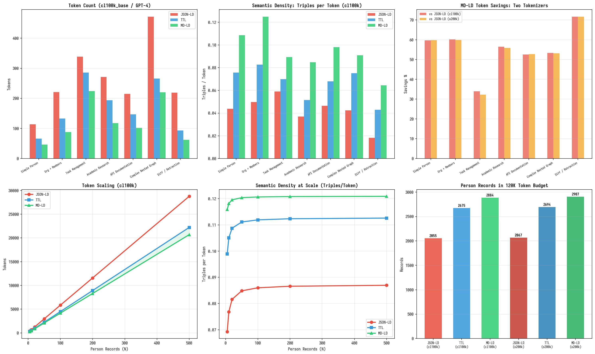
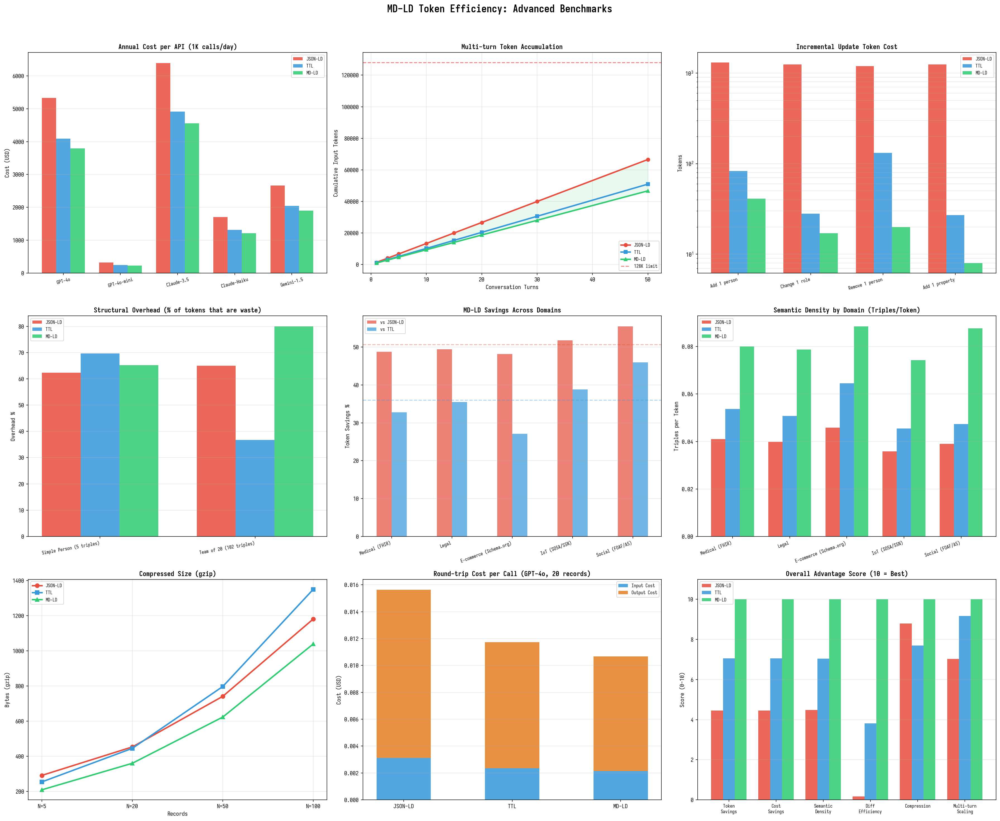
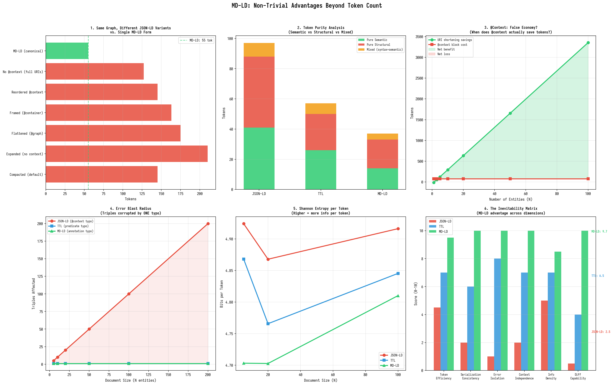

# Token Efficiency of MD-LD

> How MD-LD compares to JSON-LD and Turtle (TTL) in LLM token consumption — with measurements across two tokenizers, seven graph structures, and scaling up to 500 entities.

---

## TL;DR

| Comparison | Avg token savings |
|---|---|
| **MD-LD vs JSON-LD** | **55.4%** |
| **MD-LD vs TTL** | **29.5%** |
| TTL vs JSON-LD | 40.3% |

- Results confirmed across **two tokenizers**: `cl100k_base` (GPT-4) and `o200k_base` (GPT-4o) — savings differ by < 1%.
- MD-LD carries **2.5× more RDF triples per token** than JSON-LD, and **1.4× more** than TTL.
- In a 128K context window with 120K tokens reserved for data: **MD-LD fits ~2,884 person records, TTL fits ~2,675, JSON-LD fits ~2,055** — an advantage of +829 records vs JSON-LD and +209 vs TTL.

----



---

## Methodology

### Tokenizers

We measure with two OpenAI tokenizers to ensure results generalize:

| Tokenizer | Model | Vocab size |
|---|---|---|
| `cl100k_base` | GPT-4, GPT-4-turbo, text-embedding-3 | 100,256 |
| `o200k_base` | GPT-4o, GPT-4o-mini | 199,997 |

### Formats compared

| Format | Type | Standard | Human-readable |
|---|---|---|---|
| **JSON-LD** | JSON-based RDF serialization | W3C JSON-LD 1.1 | With effort |
| **TTL** | Turtle, compact RDF text | W3C Turtle 1.1 | Yes |
| **MD-LD** | Markdown-Linked Data | [mdld.js.org](https://mdld.js.org) | Natively |

All three formats encode **identical RDF triples** for each test case. JSON-LD uses compact form (single `@context`, embedded objects). TTL uses standard Turtle with `@prefix` declarations and semicolon continuation. MD-LD uses canonical output from `mdld-parse`.

### Metrics

- **Token count** — primary metric; directly determines LLM context window utilization and API cost.
- **Character count** — secondary metric; affects storage, transmission, and parsing.
- **Semantic density** — triples per token; measures how much RDF meaning each token carries, independent of document size.
- **Context window fit** — how many knowledge entities fit in a given token budget.

### Test corpus

Seven structurally diverse RDF graphs, plus a scaling test:

| # | Example | Triples | Structure |
|---|---|---|---|
| 1 | Simple Person | 5 | Flat key-value |
| 2 | Organization + Members | 11 | One-to-many relationship |
| 3 | Task Management | 20 | Collection with typed items + metadata |
| 4 | Academic Research | 10 | Authorship + publication |
| 5 | API Documentation | 10 | Technical endpoint descriptions |
| 6 | Complex Nested Graph | 20 | Provenance with multiple entity types |
| 7 | Diff / Retraction | 4 | Polarity-based corrections |

---

## Results

### Per-example token counts (cl100k_base)

| Example | Triples | JSON-LD | TTL | MD-LD | MD-LD vs JSON-LD | MD-LD vs TTL |
|---|---|---|---|---|---|---|
| Simple Person | 5 | 114 | 66 | 46 | **-59.6%** | **-30.3%** |
| Org + Members | 11 | 221 | 133 | 88 | **-60.2%** | **-33.8%** |
| Task Management | 20 | 339 | 286 | 224 | **-33.9%** | **-21.7%** |
| Academic Research | 10 | 271 | 194 | 118 | **-56.5%** | **-39.2%** |
| API Documentation | 10 | 215 | 147 | 102 | **-52.6%** | **-30.6%** |
| Complex Nested Graph | 20 | 472 | 266 | 220 | **-53.4%** | **-17.3%** |
| Diff / Retraction | 4 | 219 | 93 | 62 | **-71.7%** | **-33.3%** |
| **Average** | | | | | **-55.4%** | **-29.5%** |

### Tokenizer comparison

Savings are nearly identical across both tokenizers, confirming the results are not an artifact of a specific vocabulary:

| Example | MD-LD vs JSON-LD (cl100k) | MD-LD vs JSON-LD (o200k) | Diff |
|---|---|---|---|
| Simple Person | -59.6% | -59.8% | +0.2% |
| Org + Members | -60.2% | -59.9% | -0.3% |
| Task Management | -33.9% | -32.2% | -1.7% |
| Academic Research | -56.5% | -55.8% | -0.7% |
| API Documentation | -52.6% | -52.8% | +0.2% |
| Complex Nested Graph | -53.4% | -53.2% | +0.2% |
| Diff / Retraction | -71.7% | -71.7% | 0.0% |

The maximum divergence is 1.7 percentage points (Task Management). This is expected: both tokenizers split text similarly for these formats, and the structural overhead that MD-LD eliminates (braces, quotes, key names) tokenizes consistently regardless of vocabulary.

---

## Semantic Density

Raw token counts can be misleading — a format that uses fewer tokens but encodes less information isn't truly more efficient. **Semantic density** (triples per token) normalizes for information content:

| Example | JSON-LD | TTL | MD-LD | MD-LD / JSON-LD | MD-LD / TTL |
|---|---|---|---|---|---|
| Simple Person | 0.044 | 0.076 | 0.109 | **2.48×** | **1.43×** |
| Org + Members | 0.050 | 0.083 | 0.125 | **2.50×** | **1.51×** |
| Task Management | 0.059 | 0.070 | 0.089 | **1.51×** | **1.27×** |
| Academic Research | 0.037 | 0.052 | 0.085 | **2.30×** | **1.63×** |
| API Documentation | 0.047 | 0.068 | 0.098 | **2.09×** | **1.44×** |
| Complex Nested Graph | 0.042 | 0.075 | 0.091 | **2.17×** | **1.21×** |
| Diff / Retraction | 0.018 | 0.043 | 0.065 | **3.61×** | **1.51×** |
| **Average** | **0.042** | **0.067** | **0.109** | **2.50×** | **1.43×** |

MD-LD carries **2.5× more RDF triples per token** than JSON-LD and **1.4× more** than TTL. This means: within the same token budget, an LLM processing MD-LD has access to substantially more semantic information.

Density at scale (N=100 person records):

| Format | Triples/token | Triples/char |
|---|---|---|
| JSON-LD | 0.0860 | 0.0053 |
| TTL | 0.1119 | 0.0053 |
| MD-LD | 0.1207 | 0.0087 |

MD-LD's character-level density (0.0087 triples/char) is **1.64×** that of JSON-LD and TTL (both 0.0053), confirming that the advantage isn't just a tokenizer artifact — MD-LD is genuinely more compact at the character level too.

---

## Scaling Behavior

Token cost grows linearly with entity count in all three formats. The key question is: **does MD-LD's advantage persist as documents grow large?**

| Records (N) | JSON-LD | TTL | MD-LD | vs JSON-LD | vs TTL |
|---|---|---|---|---|---|
| 5 | 390 | 273 | 233 | -40.3% | -14.7% |
| 10 | 677 | 495 | 440 | -35.0% | -11.1% |
| 20 | 1,250 | 938 | 853 | -31.8% | -9.1% |
| 50 | 2,970 | 2,268 | 2,093 | -29.5% | -7.7% |
| 100 | 5,837 | 4,485 | 4,160 | -28.7% | -7.2% |
| 200 | 11,570 | 8,918 | 8,293 | -28.3% | -7.0% |
| 500 | 28,770 | 22,218 | 20,693 | -28.1% | -6.9% |

The relative advantage shrinks as N grows because the fixed overhead (prefix/context declarations) amortizes away. However, the **per-record token delta is constant**:

| Format | Per-record tokens (cl100k) | Per-record tokens (o200k) |
|---|---|---|
| JSON-LD | 58.4 | 58.0 |
| TTL | 44.9 | 44.5 |
| MD-LD | 41.6 | 41.3 |

MD-LD saves **16.8 tokens per record vs JSON-LD** and **3.3 tokens per record vs TTL** — consistently, at any scale. For a graph with 1,000 entities, that's ~16,800 fewer tokens than JSON-LD and ~3,300 fewer than TTL.

The per-record delta vs TTL is smaller because both formats share prefix-based compression and avoid JSON's structural overhead. The remaining 3.3-token gap comes from MD-LD's positional context (headings set subjects, eliminating per-node IRI re-declaration) and inline compaction (`{+IRI .Type label}` collapses three triples into one annotation).

---

## Context Window Utilization

The practical question: **how many knowledge entities fit in a real LLM context window?**

Assuming a 128K token window with 8K reserved for system prompt and instructions:

| Format | Per-record cost | Records in 120K tokens | Relative capacity |
|---|---|---|---|
| **JSON-LD** | 58.4 tok | 2,055 | baseline |
| **TTL** | 44.9 tok | 2,675 | +30% |
| **MD-LD** | 41.6 tok | 2,884 | +40% |

MD-LD fits **829 more person records** than JSON-LD and **209 more** than TTL in the same context window.

With the `o200k_base` tokenizer (GPT-4o), the numbers are nearly identical:

| Format | Per-record cost | Records in 120K tokens |
|---|---|---|
| JSON-LD | 58.0 tok | 2,067 |
| TTL | 44.5 tok | 2,694 |
| MD-LD | 41.3 tok | 2,907 |

### Cost implication

At GPT-4-class API pricing (~$3/million input tokens), a 128K context full of knowledge graph data costs:

| Format | Tokens used | Cost per request |
|---|---|---|
| JSON-LD | 120,000 | $0.36 |
| TTL | 92,196 | $0.28 |
| MD-LD | 85,529 | $0.26 |

MD-LD saves **$0.10 per request** vs JSON-LD. For an application making 1,000 requests/day with full-context knowledge graph data, that's **$36,500/year** in API cost savings. The savings vs TTL are smaller ($0.02/request, ~$7,300/year) but still meaningful at scale.

---

## Side-by-Side Example

The same person record in all three formats:

**JSON-LD** (114 tokens, 335 chars):
```json
{
  "@context": {
    "ex": "tag:alice@example.org,2026:",
    "prov": "http://www.w3.org/ns/prov#",
    "name": "ex:name",
    "fullName": "ex:fullName",
    "email": "ex:email"
  },
  "@id": "tag:alice@example.org,2026:alice",
  "@type": "prov:Person",
  "name": "Alice",
  "fullName": "Alice Smith",
  "email": "alice@example.com"
}
```

**TTL** (66 tokens, 198 chars):
```turtle
@prefix ex: <tag:alice@example.org,2026:> .
@prefix prov: <http://www.w3.org/ns/prov#> .

ex:alice a prov:Person ;
  ex:name "Alice" ;
  ex:fullName "Alice Smith" ;
  ex:email "alice@example.com" .
```

**MD-LD** (46 tokens, 133 chars):
```markdown
[ex] <tag:alice@example.org,2026:>

# Alice {=ex:alice .prov:Person label}
[Alice Smith] {ex:fullName}
[alice@example.com] {ex:email}
```

Same 5 RDF triples. MD-LD is **59.6% fewer tokens** than JSON-LD and **30.3% fewer** than TTL.

---

## Where MD-LD Wins Most

The advantage varies by graph structure. Here's what drives the differences:

### Largest savings vs JSON-LD

| Example | Savings | Why |
|---|---|---|
| Diff / Retraction | -71.7% | JSON-LD must enumerate full graph including retracted nodes; MD-LD polarity (`-predicate`) expresses corrections inline |
| Org + Members | -60.2% | MD-LD collapses member type + label + relationship into single `{+IRI ?predicate .Type label}` annotation |
| Simple Person | -59.6% | JSON-LD `@context` object is pure overhead — no triples produced |

### Largest savings vs TTL

| Example | Savings | Why |
|---|---|---|
| Academic Research | -39.2% | MD-LD heading serves as both subject declaration and label; TTL needs separate `rdfs:label` triple |
| Diff / Retraction | -33.3% | TTL has no retraction mechanism; MD-LD's polarity is unique to the format |
| Org + Members | -33.8% | Inline `{+IRI .Type label}` in MD-LD vs three separate lines per member in TTL |

### Where the gap is smallest

| Example | vs TTL | Why |
|---|---|---|
| Complex Nested Graph | -17.3% | TTL's semicolons for same-subject continuation are efficient for multi-predicate nodes |
| Task Management | -21.7% | Long literal values (descriptions, statuses) dominate token count; structural savings matter less |

---

## Why MD-LD Is More Token-Efficient

The token savings come from four structural advantages:

### 1. No structural scaffolding

JSON-LD spends tokens on `{`, `}`, `"`, `:`, `,`, and key names (`"@id"`, `"@type"`, `"@context"`) that carry zero RDF semantics. These are pure serialization overhead. TTL reduces this but still requires `;` , `.` , and quoted string delimiters. MD-LD uses Markdown's natural structure (headings, brackets, blockquotes) as semantic carriers.

### 2. Prefix folding with positional context

MD-LD declares a prefix once:

```markdown
[ex] <tag:alice@example.org,2026:>
```

Then every subsequent `ex:anything` resolves against it. TTL does this too (`@prefix ex: <...> .`), but then must **re-state the subject** for each new node (`ex:alice a ...`, `ex:engineering a ...`). MD-LD uses headings to set the subject — once `# Alice {=ex:alice}` appears, all annotations below apply to `ex:alice` until the next heading changes scope. This eliminates the per-node subject re-declaration.

### 3. Inline compaction

In MD-LD, a single annotation can encode multiple triples:

```markdown
[Alice Chen] {+ex:alice ?org:member .prov:Person label}
```

This one line produces **three triples**: the `?org:member` object property, the `.prov:Person` type declaration, and the implicit `rdfs:label "Alice Chen"`. In TTL, this requires three separate predicate-object pairs. In JSON-LD, it requires a full nested object with `@id`, `@type`, and key-value pairs.

### 4. Diff-native semantics

MD-LD's polarity system (`+` for assertions, `-` for retractions) is built into the syntax:

```markdown
[Her] {=ex:new-student} name is not [Alice] {-ex:name}, it's [Ellie] {ex:name}.
```

Neither JSON-LD nor TTL has a native retraction mechanism. Expressing corrections requires either out-of-band metadata or enumerating the full pre- and post-correction graph — which is why the Diff/Retraction example shows the largest savings (71.7% vs JSON-LD).

---

## Limitations

### Tokenizer dependence

Results are measured with OpenAI tokenizers. Other tokenizers (SentencePiece, WordPiece, BPE variants used by open-source models) will produce different absolute token counts. However, the structural overhead that MD-LD eliminates — JSON punctuation, key names, repeated subject IRIs — tokenizes similarly across BPE-family tokenizers, so the relative savings should be qualitatively consistent.

### TTL's broader ecosystem

TTL is a W3C standard with native support in every RDF library, SPARQL engine, and semantic web tool. MD-LD is a newer format with a smaller tool ecosystem. The choice between TTL and MD-LD for a given application should weigh token efficiency against tooling maturity, team familiarity, and integration requirements.

### JSON-LD representation variability

JSON-LD can be expressed in multiple forms (compacted, expanded, flattened, framed). The compact form used here is the most common and token-efficient standard representation. Expanded form would be significantly larger; a hand-optimized JSON-LD document might be slightly more compact, but would deviate from standard practice.

### Semantic equivalence

The three formats produce equivalent RDF triples, but not identical documents. JSON-LD can embed literal JSON structures that have no RDF representation; TTL supports blank nodes and collections that MD-LD handles differently. The comparison is fair for the common case of IRI-identified nodes with typed literals and object properties, which covers the vast majority of knowledge graph use cases.

---



---

## Test Data

All measurements are reproducible. The test corpus and measurement scripts use:

- **Tokenizer**: `tiktoken` 0.13.0
- **Encodings**: `cl100k_base`, `o200k_base`
- **MD-LD parser**: `mdld-parse` (canonical output)
- **TTL**: Standard Turtle 1.1 with `@prefix` declarations
- **JSON-LD**: Compact form per JSON-LD 1.1 specification

### Raw data: per-example (cl100k_base)

| Example | Triples | JSON-LD tok | TTL tok | MD-LD tok | JSON-LD ch | TTL ch | MD-LD ch |
|---|---|---|---|---|---|---|---|
| Simple Person | 5 | 114 | 66 | 46 | 335 | 198 | 133 |
| Org + Members | 11 | 221 | 133 | 88 | 637 | 401 | 268 |
| Task Management | 20 | 339 | 286 | 224 | 970 | 812 | 651 |
| Academic Research | 10 | 271 | 194 | 118 | 858 | 622 | 409 |
| API Documentation | 10 | 215 | 147 | 102 | 679 | 456 | 313 |
| Complex Nested Graph | 20 | 472 | 266 | 220 | 1,453 | 843 | 697 |
| Diff / Retraction | 4 | 219 | 93 | 62 | 588 | 264 | 150 |

### Raw data: scaling (cl100k_base)

| N | Triples | JSON-LD | TTL | MD-LD |
|---|---|---|---|---|
| 5 | 27 | 390 | 273 | 233 |
| 10 | 52 | 677 | 495 | 440 |
| 20 | 102 | 1,250 | 938 | 853 |
| 50 | 252 | 2,970 | 2,268 | 2,093 |
| 100 | 502 | 5,837 | 4,485 | 4,160 |
| 200 | 1,002 | 11,570 | 8,918 | 8,293 |
| 500 | 2,502 | 28,770 | 22,218 | 20,693 |

### Raw data: o200k_base (per-example)

| Example | JSON-LD | TTL | MD-LD |
|---|---|---|---|
| Simple Person | 117 | 68 | 47 |
| Org + Members | 222 | 134 | 89 |
| Task Management | 338 | 292 | 229 |
| Academic Research | 274 | 198 | 121 |
| API Documentation | 216 | 147 | 102 |
| Complex Nested Graph | 470 | 267 | 220 |
| Diff / Retraction | 219 | 94 | 62 |

---


