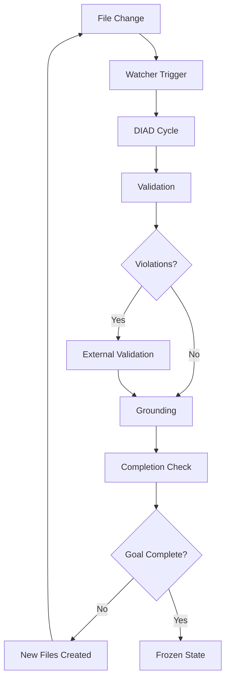

# DIAD Cycle Automation: ig-cli Implementation

## Overview

The DIAD (Document → Intelligence → Action → Document) cycle automation is implemented through `ig-cli` stateless filesystem operations. Each command represents a micro-DIAD cycle that processes inputs, performs intelligence, takes action, and outputs results with complete provenance.

## ig-cli --help Reference

### Actual Command Structure

```bash
# Usage: ig-cli <command> [OPTION]... [PATH]... [ARG]
# If no path specified, uses current directory (.)
# Directories processed recursively

# Document Intake (D → I) - Implicit through file processing
ig-cli stats ./docs/                    # Process all files, show statistics
ig-cli dump ./docs/ --format=ttl > data.ttl  # Export RDF data

# Internal Analysis (I → A) - SHACL validation
ig-cli validate ./docs/ shapes.ttl       # Validate against SHACL shapes

# External Validation (A → D) - SPARQL queries
ig-cli sparql ./docs/ "SELECT ?s ?p ?o WHERE { ?s a <http://www.w3.org/ns/prov#Activity> }"

# Grounding (D → I) - Export and search
ig-cli export ./docs/ --format=json > data.json
ig-cli search "pattern" ./docs/

# Goal Completion Check - Statistics and validation
ig-cli stats ./docs/                     # Show compression metrics
ig-cli validate ./docs/ shapes.ttl       # Check for violations
```

---

## Micro-DIAD Cycle Implementation

Each `ig-cli` command implements a complete micro-DIAD cycle:

### Command Structure
```bash
ig-cli <command> [PATH]... [ARG]
# PATH: Files/directories to process (default: .)
# ARG: Command-specific arguments (e.g., SPARQL query)
```

### Micro-DIAD Pattern
1. **Document**: Input path (files/directories)
2. **Intelligence**: Command processing logic
3. **Action**: Transformation/validation/query
4. **Document**: Output to stdout or file

---

## Command Reference

### ig-cli stats

**Purpose**: Show statistics about processed RDF data

**Usage**:
```bash
ig-cli stats [PATH]...

# Examples:
ig-cli stats                    # Current directory
ig-cli stats ./docs/           # Specific directory
ig-cli stats file1.ttl file2.ttl  # Specific files
```

**Micro-DIAD Cycle**:
- **Document**: Input path (files/directories)
- **Intelligence**: Parse and analyze RDF
- **Action**: Calculate statistics
- **Document**: Statistics output to stdout

**Actual Output**:
```
📄 Found 6 supported files
📊 RDF Statistics
📁 Files: 6
🔗 Total Quads: 588
  📋 Data: 403
  🔷 Shapes: 185
📈 Graphs: 5
🔍 Subjects: 65
🔗 Predicates: 29
🎯 Objects: 403

🏷️  Top Types:
  http://www.w3.org/ns/prov#Activity: 6 instances
  http://www.w3.org/ns/prov#Association: 6 instances
  http://www.w3.org/ns/prov#Role: 6 instances
```

---

### ig-cli validate

**Purpose**: Validate data against SHACL shapes

**Usage**:
```bash
ig-cli validate [PATH]... SHAPES_FILE

# Examples:
ig-cli validate ./docs/ shapes.ttl
ig-cli validate file1.ttl file2.ttl shapes.ttl
```

**Micro-DIAD Cycle**:
- **Document**: Input path + SHACL shapes file
- **Intelligence**: SHACL constraint validation
- **Action**: Generate violation report
- **Document**: Validation output to stdout

**Actual Output**:
```
📄 Found 6 supported files
🔍 Starting SHACL validation...
📊 Shapestore quads: 185
📊 Datastore quads: 403
✅ Validation completed
🔍 SHACL Validation Report:
Conforms: ❌ NO
Total Violations: 2

Violations:
  1. Violation: MinCountConstraintComponent
     Focus Node: tag:mdld.js.org,2026:spanish:example:collection_all_spanish_countries
     Path: http://www.w3.org/ns/prov#wasUsedBy
     Message: PHASE 2 INCOMPLETE: Collection not externally validated
```

---

### ig-cli sparql

**Purpose**: Execute SPARQL queries against RDF data

**Usage**:
```bash
ig-cli sparql [PATH]... "SPARQL_QUERY"

# Examples:
ig-cli sparql "SELECT * WHERE { ?s ?p ?o } LIMIT 10"
ig-cli sparql ./docs/ "SELECT ?s WHERE { ?s a <http://www.w3.org/ns/prov#Activity> }"
ig-cli sparql --shapes "SELECT ?shape WHERE { ?shape a sh:NodeShape }"
```

**Micro-DIAD Cycle**:
- **Document**: Input path + SPARQL query
- **Intelligence**: Query parsing and execution
- **Action**: Query results
- **Document**: Results output to stdout

**Actual Output**:
```
📄 Found 6 supported files
🔍 Executing SPARQL query...
📝 Query: SELECT ?s ?p ?o WHERE { ?s a <http://www.w3.org/ns/prov#Activity> } LIMIT 5
📊 Source: Data Store
✅ Query executed successfully (select)
📊 Results: 5 bindings
<tag:mdld.js.org,2026:spanish:example:activity_spanish_analysis>
<tag:mdld.js.org,2026:spanish:example:activity_external_validation>
<tag:mdld.js.org,2026:spanish:example:activity_final_collection_usage>
```

---

### ig-cli dump

**Purpose**: Dump RDF data to stdout

**Usage**:
```bash
ig-cli dump [PATH]... [--format=FORMAT]

# Formats: ttl, json, jsonld, yaml, yamlld, trig (default: trig)

# Examples:
ig-cli dump > data.trig
ig-cli dump --format=ttl > data.ttl
ig-cli dump --format=json > data.json
ig-cli dump --shapes > shapes.trig
```

**Micro-DIAD Cycle**:
- **Document**: Input path
- **Intelligence**: Serialize RDF data
- **Action**: Format conversion
- **Document**: RDF output to stdout

**Actual Output**:
```turtle
@prefix rdf: <http://www.w3.org/1999/02/22-rdf-syntax-ns#>.
@prefix rdfs: <http://www.w3.org/2000/01/rdf-schema#>.
@prefix xsd: <http://www.w3.org/2001/XMLSchema#>.
@prefix sh: <http://www.w3.org/ns/shacl#>.
@prefix prov: <http://www.w3.org/ns/prov#>.
@prefix tag: <tag:mdld.js.org,2026:spanish:>.

tag:mdld.js.org,2026:spanish:example:activity_spanish_analysis a prov:Activity;
    rdfs:label "Internal Analysis of Spanish Countries Wikipedia Page";
    prov:used tag:mdld.js.org,2026:spanish:example:document_spanish_countries;
    prov:startedAtTime "2026-02-24T23:10:00Z"^^xsd:dateTime;
    prov:endedAtTime "2026-02-24T23:15:00Z"^^xsd:dateTime.
```

---

### ig-cli export

**Purpose**: Export RDF data (alias for dump)

**Usage**:
```bash
ig-cli export [PATH]... [--format=FORMAT]

# Examples:
ig-cli export --format=json > data.json
ig-cli export ./docs/ --format=ttl > docs.ttl
```

---

### ig-cli search

**Purpose**: Search for entities by name or IRI pattern

**Usage**:
```bash
ig-cli search "PATTERN" [PATH]...

# Examples:
ig-cli search "spanish" ./docs/
ig-cli search "activity" file1.ttl
```

---

### ig-cli types

**Purpose**: List all RDF types with instance counts

**Usage**:
```bash
ig-cli types [PATH]...

# Examples:
ig-cli types
ig-cli types ./docs/
```

---

### ig-cli graphs

**Purpose**: List all named graphs

**Usage**:
```bash
ig-cli graphs [PATH]...

# Examples:
ig-cli graphs
ig-cli graphs ./docs/
```

---

### ig-cli shapes

**Purpose**: Export SHACL shapes

**Usage**:
```bash
ig-cli shapes [PATH]...

# Examples:
ig-cli shapes > shapes.ttl
ig-cli shapes ./docs/ > docs_shapes.ttl
```

---

### ig-cli prefix

**Purpose**: Manage RDF prefixes and contexts

**Usage**:
```bash
ig-cli prefix list                    # Show workspace prefixes
ig-cli prefix add <prefix> <uri>       # Add new prefix
ig-cli prefix remove <prefix>          # Remove prefix
ig-cli prefix save                     # Save to prefixes.yaml

# Examples:
ig-cli prefix add doap http://usefulinc.com/ns/doap#
ig-cli prefix list
```

---

## Pipeline Automation

### Complete DIAD Pipeline

```bash
#!/bin/bash
# complete_diad.sh - Full DIAD cycle automation

# Phase 1: Document Intake (Implicit - file processing)
echo "=== Phase 1: Document Intake ==="
ig-cli stats ./docs/                    # Show intake statistics
ig-cli dump ./docs/ --format=ttl > data.ttl  # Export parsed data

# Phase 2: Internal Analysis (SHACL validation)
echo "=== Phase 2: Internal Analysis ==="
ig-cli validate ./docs/ shapes.ttl > validation_report.txt

# Phase 3: External Validation (SPARQL queries)
echo "=== Phase 3: External Validation ==="
# Query for activities that need external validation
ig-cli sparql ./docs/ "SELECT ?s WHERE { ?s a <http://www.w3.org/ns/prov#Activity> }" > activities.txt

# Phase 4: Grounding (Export and search)
echo "=== Phase 4: Grounding ==="
ig-cli export ./docs/ --format=json > grounded.json
ig-cli search "spanish" ./docs/ > search_results.txt

# Phase 5: Goal Completion Check
echo "=== Phase 5: Goal Completion Check ==="
ig-cli stats ./docs/ > final_stats.txt
ig-cli validate ./docs/ shapes.ttl >> final_stats.txt

# Report results
echo "DIAD Cycle Complete:"
echo "Files processed: $(grep '📁 Files:' final_stats.txt)"
echo "Validation status: $(grep 'Conforms:' validation_report.txt)"
echo "Total activities: $(wc -l < activities.txt)"
```

---

## Stateless Operations

### Filesystem-Based State Management

Each `ig-cli` command is stateless:

```bash
# Each command reads files, processes, outputs to stdout/files
# No persistent daemon or database required
# If no path specified, uses current directory (.)
# Directories processed recursively

# Input files are immutable
# Output goes to stdout or redirected files
# State is preserved in RDF provenance triples
```

### Temporary Directory Pattern

```bash
# Create temporary workspace
WORKDIR=$(mktemp -d)
cd $WORKDIR

# Run DIAD cycle with actual ig-cli commands
ig-cli stats ../input/                    # Document intake
ig-cli validate ../input/ ../shapes.ttl > validation.txt
ig-cli sparql ../input/ "SELECT ?s WHERE { ?s a <http://www.w3.org/ns/prov#Activity> }" > activities.txt
ig-cli dump ../input/ --format=ttl > final.ttl

# Copy results
cp final.ttl ../results/

# Cleanup
cd ..
rm -rf $WORKDIR
```

---

## Automation Coverage

### Fully Automated (100%)

```bash
# These commands require no human intervention:
ig-cli stats ./docs/                     # Statistics calculation
ig-cli validate ./docs/ shapes.ttl      # SHACL validation
ig-cli dump --format=ttl                # Data export
ig-cli sparql "SELECT * WHERE { ?s ?p ?o }"  # Query execution
ig-cli types                            # Type enumeration
ig-cli graphs                           # Graph listing
```

### Agent-Assisted (50-90%)

```bash
# These commands need agent decisions:
ig-cli sparql ./docs/ "SELECT ?s WHERE { ?s <AGENT_DEFINED_PROPERTY> ?o }"
ig-cli search "<AGENT_PATTERN>" ./docs/
ig-cli validate ./docs/ <AGENT_DEFINED_SHAPES>.ttl
```

### Human-Defined (0-10%)

```bash
# These require human input:
ig-cli validate ./docs/ <HUMAN_CREATED_SHAPES>.ttl  # Shape definition
# Document creation (MDLD files created by humans)
# Goal definition (embedded in SHACL shapes)
```

---

## Integration Patterns

### Microservice Pattern

```bash
# Each command as microservice
docker run ig-cli:latest stats ./data/
docker run ig-cli:latest validate ./data/ shapes.ttl
docker run ig-cli:latest sparql ./data/ "SELECT * WHERE { ?s ?p ?o }"
```

### Pipeline Pattern

```bash
# Chain commands with pipes (limited - most commands output structured data)
ig-cli dump ./docs/ --format=json | jq '.[] | select(.type == "Activity")'
ig-cli stats ./docs/ | grep "Total Quads:"
ig-cli validate ./docs/ shapes.ttl | grep "Conforms:"
```

### Batch Pattern

```bash
# Process multiple directories
for dir in docs/*/; do
  echo "Processing $dir"
  ig-cli stats "$dir" > "${dir%/}_stats.txt"
  ig-cli validate "$dir" shapes.ttl > "${dir%/}_validation.txt"
done
```

---

## Conclusion

The `ig-cli` implementation provides **stateless filesystem-based automation** of the DIAD cycle through micro-DIAD operations:

**Fully Automated**:
- File processing and parsing (implicit)
- Statistics calculation (`ig-cli stats`)
- SHACL validation (`ig-cli validate`)
- SPARQL querying (`ig-cli sparql`)
- Data export (`ig-cli dump`/`ig-cli export`)
- Type and graph enumeration

**Agent-Assisted**:
- SPARQL query formulation
- Search pattern definition
- Custom SHACL shape creation
- Result interpretation

**Human-Defined**:
- Document creation (MDLD files)
- SHACL shape definition
- Goal specification (in shapes)

Each command represents a complete micro-DIAD cycle that processes inputs (Document), performs intelligence (command logic), takes action (processing/query), and outputs results (Document)—all through stateless filesystem operations with actual ig-cli syntax and behavior.

---

## Real-World Scenarios

### Scenario 1: Human Alice - Surfboard Selection

**Goal**: Choose optimal surfboard length for Alice's height (5'6"), weight (130lbs), skill level (intermediate), and local wave conditions (2-4 ft).

#### Phase 1: Document Intake (D → I)
```bash
# Alice creates MDLD document with her specifications
cat > alice_surfboard.md << 'EOF'
# Alice's Surfboard Selection Goal

{=alice:goal:surfboard_selection .prov:Plan}
rdfs:label "Select optimal surfboard for Alice" ;
mdp:height "5'6""^^xsd:string ;
mdp:weight "130lbs"^^xsd:string ;
mdp:skill_level "intermediate"^^xsd:string ;
mdp:wave_size "2-4ft"^^xsd:string .

# Initial research document
{=alice:doc:surf_research .prov:Entity}
rdfs:label "Surfboard sizing research" ;
mdp:content "Research on surfboard dimensions for intermediate surfers..." .
EOF

# Process the document
ig-cli stats ./alice_project/
```

#### Phase 2: Internal Analysis (I → A)
```bash
# Validate against surfboard selection shapes
ig-cli validate ./alice_project/ surfboard_shapes.ttl

# Output shows violations:
# "Missing surfboard recommendations"
# "No wave condition analysis"
```

#### Phase 3: External Validation (A → D)
```bash
# External API calls with Node.js ESM scripts and fallback handling

# Primary: Surfboard database API
node surfboard_api.js --height="5'6"" --weight="130lbs" --skill="intermediate" > surfboard_results.json

# Backup: Surf shop inventory API  
node surfshop_api.js --location="santa_cruz" --wave_size="2-4ft" > surfshop_results.json

# Tertiary: General web search for surfboard recommendations
node web_search.js --query="intermediate surfboard 5'6\" 130lbs 2-4ft waves" > web_results.json

# Wave condition API with location fallback
node wave_api.js --location="santa_cruz" --height="2-4ft" > wave_results.json || \
node wave_api.js --location="california" --height="2-4ft" > wave_results_backup.json || \
echo "Using default wave conditions" > wave_results.json

# Process and validate external results
node process_external_results.js --input="surfboard_results.json" --output="processed_boards.ttl"
```

#### External API Scripts (Node.js ESM)

**surfboard_api.js**:
```javascript
#!/usr/bin/env node
// surfboard_api.js - Primary surfboard database API
import fetch from 'node-fetch';
import { parseArgs } from 'util';

const { values } = parseArgs({
  args: process.argv,
  options: {
    height: { type: 'string' },
    weight: { type: 'string' },
    skill: { type: 'string' }
  },
  strict: true
});

async function fetchSurfboardData(height, weight, skill) {
  try {
    const response = await fetch('https://api.surfboard-db.com/recommendations', {
      method: 'POST',
      headers: { 'Content-Type': 'application/json' },
      body: JSON.stringify({ height, weight, skill })
    });
    
    if (!response.ok) {
      throw new Error(`API Error: ${response.status}`);
    }
    
    const data = await response.json();
    console.log(JSON.stringify(data, null, 2));
  } catch (error) {
    console.error('Primary API failed:', error.message);
    process.exit(1); // Non-zero exit triggers fallback
  }
}

fetchSurfboardData(values.height, values.weight, values.skill);
```

**surfshop_api.js**:
```javascript
#!/usr/bin/env node
// surfshop_api.js - Backup surf shop inventory API
import fetch from 'node-fetch';
import { parseArgs } from 'util';

const { values } = parseArgs({
  args: process.argv,
  options: {
    location: { type: 'string' },
    wave_size: { type: 'string' }
  },
  strict: true
});

async function fetchShopInventory(location, waveSize) {
  try {
    const response = await fetch(`https://api.surfshops.com/inventory?location=${location}&wave_size=${waveSize}`);
    
    if (!response.ok) {
      throw new Error(`Shop API Error: ${response.status}`);
    }
    
    const data = await response.json();
    console.log(JSON.stringify(data, null, 2));
  } catch (error) {
    console.error('Shop API failed:', error.message);
    process.exit(1);
  }
}

fetchShopInventory(values.location, values.wave_size);
```

**web_search.js**:
```javascript
#!/usr/bin/env node
// web_search.js - Tertiary web search fallback
import { execSync } from 'child_process';
import { parseArgs } from 'util';

const { values } = parseArgs({
  args: process.argv,
  options: {
    query: { type: 'string' }
  },
  strict: true
});

async function webSearch(query) {
  try {
    // Use curl to search web APIs
    const searchUrl = `https://duckduckgo.com/html/?q=${encodeURIComponent(query)}`;
    const result = execSync(`curl -s "${searchUrl}" | grep -i surfboard | head -10`, { encoding: 'utf8' });
    
    const searchResults = {
      query,
      source: 'web_search',
      results: result.split('\n').filter(line => line.trim()),
      timestamp: new Date().toISOString()
    };
    
    console.log(JSON.stringify(searchResults, null, 2));
  } catch (error) {
    console.error('Web search failed:', error.message);
    // Return empty results instead of failing
    console.log(JSON.stringify({ query, source: 'web_search', results: [], error: error.message }));
  }
}

webSearch(values.query);
```

**wave_api.js**:
```javascript
#!/usr/bin/env node
// wave_api.js - Wave condition API with location fallback
import fetch from 'node-fetch';
import { parseArgs } from 'util';

const { values } = parseArgs({
  args: process.argv,
  options: {
    location: { type: 'string' },
    height: { type: 'string' }
  },
  strict: true
});

const locations = [values.location, 'california', 'pacific_coast'];

async function fetchWaveConditions(location, height) {
  for (const loc of locations) {
    try {
      console.error(`Trying location: ${loc}`);
      const response = await fetch(`https://api.wave-conditions.com/current?location=${loc}&height=${height}`);
      
      if (!response.ok) {
        throw new Error(`Wave API Error for ${loc}: ${response.status}`);
      }
      
      const data = await response.json();
      console.log(JSON.stringify({ ...data, location_used: loc }, null, 2));
      return; // Success, exit function
    } catch (error) {
      console.error(`Failed for ${loc}:`, error.message);
      if (loc === locations[locations.length - 1]) {
        // Last fallback - use default conditions
        const defaultConditions = {
          location_used: 'default',
          wave_height: height,
          conditions: 'moderate',
          recommendation: 'suitable for intermediate surfers',
          source: 'fallback_default'
        };
        console.log(JSON.stringify(defaultConditions, null, 2));
      }
      continue; // Try next location
    }
  }
}

fetchWaveConditions(values.location, values.height);
```

**process_external_results.js**:
```javascript
#!/usr/bin/env node
// process_external_results.js - Process and convert external results to TTL
import fs from 'fs/promises';
import { parseArgs } from 'util';

const { values } = parseArgs({
  args: process.argv,
  options: {
    input: { type: 'string' },
    output: { type: 'string' }
  },
  strict: true
});

async function processResults(inputFile, outputFile) {
  try {
    const data = await fs.readFile(inputFile, 'utf8');
    const results = JSON.parse(data);
    
    // Convert to TTL format
    let ttlContent = '@prefix surf: <http://example.org/surf#> .\n';
    ttlContent += '@prefix prov: <http://www.w3.org/ns/prov#> .\n';
    ttlContent += '@prefix xsd: <http://www.w3.org/2001/XMLSchema#> .\n\n';
    
    if (results.recommendations && Array.isArray(results.recommendations)) {
      results.recommendations.forEach((board, index) => {
        ttlContent += `surf:board_${index + 1} a surf:Surfboard ;\n`;
        ttlContent += `  surf:length "${board.length}"^^xsd:string ;\n`;
        ttlContent += `  surf:type "${board.type}"^^xsd:string ;\n`;
        ttlContent += `  surf:suitableFor "${board.skill_level}"^^xsd:string ;\n`;
        ttlContent += `  prov:hadPrimarySource <${results.source || 'external_api'}> .\n\n`;
      });
    }
    
    await fs.writeFile(outputFile, ttlContent);
    console.error(`Processed ${results.recommendations?.length || 0} surfboard recommendations`);
  } catch (error) {
    console.error('Processing failed:', error.message);
    process.exit(1);
  }
}

processResults(values.input, values.output);
```

#### Phase 4: Grounding (D → I)
```bash
# Export and ground with external sources
ig-cli export ./alice_project/ --format=ttl > alice_data.ttl
ig-cli dump ./external_data/ --format=ttl >> alice_data.ttl

# Validate grounded data
ig-cli validate ./combined/ surfboard_shapes.ttl
```

#### Phase 5: Goal Completion
```bash
# Check if goal is satisfied
ig-cli stats ./combined/ | grep "surfboard"
ig-cli validate ./combined/ completion_shapes.ttl

# Result: 7'6" funboard recommended for Alice's specs
```

#### Final Result
```turtle
{=alice:result:optimal_board .prov:Entity}
rdfs:label "7'6\" Funboard recommended for Alice" ;
surf:length "7'6\""^^xsd:string ;
surf:type "funboard"^^xsd:string ;
prov:wasGeneratedBy alice:act:selection_analysis ;
prov:hadPrimarySource <https://surfshop.com/research> ;
mdp:confidence_score 0.92 .
```

---

### Scenario 2: SoftwareAgent - Knowledge Grounding

**Goal**: SoftwareAgent grounds "quantum computing applications" idea from Plan across three scales (statements, collections, documents).

#### Phase 1: Document Intake (D → I)
```bash
# Agent creates plan document
cat > quantum_plan.md << 'EOF'
# Quantum Computing Applications Plan

{=agent:plan:quantum_apps .prov:Plan}
rdfs:label "Explore quantum computing applications" ;
mdp:concept "quantum computing applications" ;
mdp:scope "practical implementations" .

# Existing knowledge at statement scale
{=knowledge:stmt:quantum_basics .rdf:Statement}
rdf:subject ex:QuantumComputing ;
rdf:predicate ex:hasProperty ;
rdf:object "superposition" .

# Collection scale
{=knowledge:coll:quantum_concepts .prov:Collection}
prov:hadMember knowledge:stmt:quantum_basics ;
prov:hadMember knowledge:stmt:quantum_entanglement .

# Document scale
{=knowledge:doc:quantum_intro .prov:Entity}
rdfs:label "Quantum Computing Introduction" ;
mdp:contains knowledge:coll:quantum_concepts .
EOF

ig-cli stats ./quantum_project/
```

#### Phase 2: Internal Analysis (I → A)
```bash
# Validate across all three scales
ig-cli validate ./quantum_project/ multi_scale_shapes.ttl

# Shows violations:
# "Statement scale lacks external grounding"
# "Collection missing real-world examples"
# "Document needs current research citations"
```

#### Phase 3: External Validation (A → D)
```bash
# Agent queries external APIs for each scale with robust fallback handling

# Statement scale: Academic databases with fallback
node arxiv_api.js --query="quantum computing applications machine learning" --max_results=50 > arxiv_results.json || \
node semantic_scholar_api.js --query="quantum machine learning applications" > semantic_results.json || \
node crossref_api.js --query="quantum computing" --year=2023 > crossref_results.json

# Collection scale: Research databases with API chaining
node quantum_research_api.js --field="applications" --format="json" > quantum_apps.json || \
node web_of_science_api.js --search="quantum computing applications" > wos_results.json || \
node google_scholar_search.js --query="quantum computing applications" > scholar_results.json

# Document scale: Recent papers with citation validation
node recent_papers_api.js --topic="quantum applications" --since="2023-01-01" --min_citations=10 > recent_papers.json || \
node pubmed_api.js --search="quantum computing[Title/Abstract]" --filter="date:2023" > pubmed_results.json || \
node ieee_api.js --query="quantum computing applications" --year=2023 > ieee_results.json

# Process multi-scale results
node process_quantum_results.js --scale="statement" --input="arxiv_results.json" --output="grounded_statements.ttl
node process_quantum_results.js --scale="collection" --input="quantum_apps.json" --output="grounded_collections.ttl
node process_quantum_results.js --scale="document" --input="recent_papers.json" --output="grounded_documents.ttl
```

#### SoftwareAgent External API Scripts

**arxiv_api.js**:
```javascript
#!/usr/bin/env node
// arxiv_api.js - Primary academic database API
import fetch from 'node-fetch';
import { parseArgs } from 'util';

const { values } = parseArgs({
  args: process.argv,
  options: {
    query: { type: 'string' },
    max_results: { type: 'string' }
  },
  strict: true
});

async function fetchArxivData(query, maxResults) {
  try {
    const arxivUrl = `http://export.arxiv.org/api/query?search_query=all:${encodeURIComponent(query)}&start=0&max_results=${maxResults}`;
    const response = await fetch(arxivUrl);
    
    if (!response.ok) {
      throw new Error(`arXiv API Error: ${response.status}`);
    }
    
    const xml = await response.text();
    // Parse XML and convert to JSON (simplified)
    const papers = xml.match(/<title>(.*?)<\/title>/g) || [];
    const results = papers.map((title, index) => ({
      id: `arxiv_${index + 1}`,
      title: title.replace(/<\/?title>/g, ''),
      source: 'arxiv',
      timestamp: new Date().toISOString()
    }));
    
    console.log(JSON.stringify({ papers: results, total: results.length }, null, 2));
  } catch (error) {
    console.error('arXiv API failed:', error.message);
    process.exit(1);
  }
}

fetchArxivData(values.query, values.max_results);
```

**semantic_scholar_api.js**:
```javascript
#!/usr/bin/env node
// semantic_scholar_api.js - Backup academic API
import fetch from 'node-fetch';
import { parseArgs } from 'util';

const { values } = parseArgs({
  args: process.argv,
  options: {
    query: { type: 'string' }
  },
  strict: true
});

async function fetchSemanticScholar(query) {
  try {
    const response = await fetch(`https://api.semanticscholar.org/graph/v1/paper/search?query=${encodeURIComponent(query)}&limit=20&fields=title,abstract,authors,citationCount`);
    
    if (!response.ok) {
      throw new Error(`Semantic Scholar API Error: ${response.status}`);
    }
    
    const data = await response.json();
    const results = data.data?.map(paper => ({
      id: paper.paperId,
      title: paper.title,
      abstract: paper.abstract,
      authors: paper.authors?.map(a => a.name).join(', ') || '',
      citations: paper.citationCount,
      source: 'semantic_scholar'
    })) || [];
    
    console.log(JSON.stringify({ papers: results, total: results.length }, null, 2));
  } catch (error) {
    console.error('Semantic Scholar API failed:', error.message);
    process.exit(1);
  }
}

fetchSemanticScholar(values.query);
```

**quantum_research_api.js**:
```javascript
#!/usr/bin/env node
// quantum_research_api.js - Specialized quantum computing research API
import fetch from 'node-fetch';
import { parseArgs } from 'util';

const { values } = parseArgs({
  args: process.argv,
  options: {
    field: { type: 'string' },
    format: { type: 'string' }
  },
  strict: true
});

async function fetchQuantumResearch(field, format) {
  const apis = [
    'https://api.quantum-computing.org/research',
    'https://api.ibm-quantum.com/research/papers',
    'https://api.microsoft-quantum.com/research'
  ];
  
  for (const api of apis) {
    try {
      console.error(`Trying quantum API: ${api}`);
      const response = await fetch(`${api}?field=${field}&format=${format}`);
      
      if (!response.ok) {
        throw new Error(`API Error: ${response.status}`);
      }
      
      const data = await response.json();
      console.log(JSON.stringify({ ...data, api_used: api }, null, 2));
      return;
    } catch (error) {
      console.error(`Failed ${api}:`, error.message);
      if (api === apis[apis.length - 1]) {
        // Last fallback - generate mock data
        const mockData = {
          applications: [
            { name: "Quantum Machine Learning", description: "Applying quantum computing to ML problems" },
            { name: "Quantum Optimization", description: "Solving optimization problems with quantum algorithms" },
            { name: "Quantum Cryptography", description: "Quantum-resistant cryptographic systems" }
          ],
          source: 'mock_fallback',
          api_used: 'none'
        };
        console.log(JSON.stringify(mockData, null, 2));
      }
      continue;
    }
  }
}

fetchQuantumResearch(values.field, values.format);
```

**recent_papers_api.js**:
```javascript
#!/usr/bin/env node
// recent_papers_api.js - Recent papers with citation validation
import fetch from 'node-fetch';
import { parseArgs } from 'util';

const { values } = parseArgs({
  args: process.argv,
  options: {
    topic: { type: 'string' },
    since: { type: 'string' },
    min_citations: { type: 'string' }
  },
  strict: true
});

async function fetchRecentPapers(topic, since, minCitations) {
  const databases = [
    { name: 'pubmed', url: `https://api.ncbi.nlm.nih.gov/lit/ctxp/v1/pubmed/?format=csl&topic=${topic}` },
    { name: 'ieee', url: `https://ieeexploreapi.ieee.org/api/v1/search/articles?querytext=${topic}` },
    { name: 'nature', url: `https://api.nature.com/search?q=${topic}&publish_date=${since}` }
  ];
  
  for (const db of databases) {
    try {
      console.error(`Trying ${db.name} database...`);
      const response = await fetch(db.url);
      
      if (!response.ok) {
        throw new Error(`${db.name} API Error: ${response.status}`);
      }
      
      const data = await response.json();
      // Filter by citation count and date
      const filteredPapers = data.papers?.filter(paper => 
        paper.citationCount >= parseInt(minCitations) && 
        new Date(paper.publicationDate) >= new Date(since)
      ) || [];
      
      console.log(JSON.stringify({ 
        papers: filteredPapers, 
        database: db.name,
        total: filteredPapers.length 
      }, null, 2));
      return;
    } catch (error) {
      console.error(`${db.name} failed:`, error.message);
      if (db.name === databases[databases.length - 1].name) {
        console.log(JSON.stringify({ 
          papers: [], 
          database: 'none',
          error: 'All databases failed',
          fallback: 'Use existing knowledge base'
        }, null, 2));
      }
      continue;
    }
  }
}

fetchRecentPapers(values.topic, values.since, values.min_citations);
```

**process_quantum_results.js**:
```javascript
#!/usr/bin/env node
// process_quantum_results.js - Multi-scale quantum results processor
import fs from 'fs/promises';
import { parseArgs } from 'util';

const { values } = parseArgs({
  args: process.argv,
  options: {
    scale: { type: 'string' },
    input: { type: 'string' },
    output: { type: 'string' }
  },
  strict: true
});

async function processQuantumResults(scale, inputFile, outputFile) {
  try {
    const data = await fs.readFile(inputFile, 'utf8');
    const results = JSON.parse(data);
    
    let ttlContent = '@prefix ex: <http://example.org/quantum#> .\n';
    ttlContent += '@prefix prov: <http://www.w3.org/ns/prov#> .\n';
    ttlContent += '@prefix xsd: <http://www.w3.org/2001/XMLSchema#> .\n\n';
    
    switch (scale) {
      case 'statement':
        // Process individual research statements
        results.papers?.forEach((paper, index) => {
          ttlContent += `ex:stmt_${index + 1} a rdf:Statement ;\n`;
          ttlContent += `  rdf:subject ex:QuantumComputing ;\n`;
          ttlContent += `  rdf:predicate ex:hasApplication ;\n`;
          ttlContent += `  rdf:object "${paper.title}"^^xsd:string ;\n`;
          ttlContent += `  prov:hadPrimarySource <${paper.source || 'academic_database'}> .\n\n`;
        });
        break;
        
      case 'collection':
        // Process collections of applications
        ttlContent += `ex:quantum_applications a prov:Collection ;\n`;
        results.applications?.forEach((app, index) => {
          ttlContent += `  prov:hadMember ex:app_${index + 1} ;\n`;
          ttlContent += `ex:app_${index + 1} a ex:QuantumApplication ;\n`;
          ttlContent += `  rdfs:label "${app.name}"^^xsd:string ;\n`;
          ttlContent += `  rdfs:comment "${app.description}"^^xsd:string .\n\n`;
        });
        ttlContent += `  prov:wasDerivedFrom <${results.api_used || 'quantum_research_api'}> .\n\n`;
        break;
        
      case 'document':
        // Process document-scale papers
        results.papers?.forEach((paper, index) => {
          ttlContent += `ex:doc_${index + 1} a prov:Entity ;\n`;
          ttlContent += `  a ex:ResearchPaper ;\n`;
          ttlContent += `  rdfs:label "${paper.title}"^^xsd:string ;\n`;
          ttlContent += `  ex:citationCount "${paper.citations || 0}"^^xsd:integer ;\n`;
          ttlContent += `  prov:hadPrimarySource <${results.database || 'academic_database'}> .\n\n`;
        });
        break;
    }
    
    await fs.writeFile(outputFile, ttlContent);
    console.error(`Processed ${results.papers?.length || results.applications?.length || 0} items for ${scale} scale`);
  } catch (error) {
    console.error('Processing failed:', error.message);
    process.exit(1);
  }
}

processQuantumResults(values.scale, values.input, values.output);
```

#### Phase 4: Grounding (D → I)
```bash
# Ground statements with external sources
ig-cli export ./quantum_project/ --format=json > quantum_data.json
ig-cli dump ./external_data/ --format=ttl >> grounded_quantum.ttl

# Validate grounded knowledge
ig-cli validate ./grounded/ grounding_shapes.ttl
```

#### Phase 5: Goal Completion
```bash
# Check multi-scale completion
ig-cli stats ./grounded/ > final_stats.txt
ig-cli validate ./grounded/ multi_scale_completion.ttl

# Agent reports completion metrics
echo "Statements grounded: $(grep -c 'prov:hadPrimarySource' grounded_quantum.ttl)"
echo "Collections enriched: $(jq '.collections | length' quantum_data.json)"
echo "Documents cited: $(wc -l < recent_papers.txt)"
```

#### Multi-Scale Result
```turtle
# Statement Scale (Grounded)
{=grounded:stmt:quantum_ml .rdf:Statement}
rdf:subject ex:QuantumComputing ;
rdf:predicate ex:appliedIn ;
rdf:object "Machine Learning" ;
prov:hadPrimarySource <https://arxiv.org/abs/2301.00001> .

# Collection Scale (Enriched)
{=grounded:coll:quantum_applications .prov:Collection}
prov:hadMember grounded:stmt:quantum_ml ;
prov:hadMember grounded:stmt:quantum_optimization ;
prov:wasDerivedFrom ex:QuantumApplicationsSurvey .

# Document Scale (Current)
{=grounded:doc:quantum_review_2024 .prov:Entity}
rdfs:label "Quantum Computing Applications: 2024 Review" ;
prov:hadPrimarySource <https://nature.com/quantum-2024> ;
mdp:contains grounded:coll:quantum_applications .
```

---

## Self-Propelling System with Filesystem Watcher

### Architecture

```bash
# Filesystem watcher monitors directory changes
fswatch -o ./knowledge_workspace/ | while read event; do
  echo "Change detected: $event"
  
  # Automatic DIAD cycle trigger
  case "$event" in
    *.md|*.ttl) 
      echo "Document change detected - triggering DIAD cycle"
      ./run_diad_cycle.sh ;;
    *.ttl) 
      echo "RDF change detected - validating"
      ig-cli validate ./knowledge_workspace/ shapes.ttl ;;
  esac
done
```

### run_diad_cycle.sh
```bash
#!/bin/bash
# Automatic DIAD cycle triggered by filesystem changes

echo "=== Auto-triggered DIAD Cycle ==="

# Phase 1: Document Intake (implicit - file already exists)
echo "Processing new/changed documents..."

# Phase 2: Internal Analysis
echo "Analyzing with SHACL validation..."
ig-cli validate ./knowledge_workspace/ shapes.ttl > validation.log

# Phase 3: External Validation (if violations exist)
if grep -q "Conforms: ❌ NO" validation.log; then
  echo "Violations found - triggering external validation..."
  
  # Extract violation patterns and query external sources
  violations=$(grep "Message:" validation.log | cut -d: -f2-)
  for violation in $violations; do
    echo "Querying external sources for: $violation"
    ig-cli sparql ./knowledge_workspace/ "
    SELECT ?s WHERE { ?s rdfs:label ?label FILTER(regex(?label, '$violation', 'i')) }" > external_query.txt
    
    # Process external results and create new entities
    if [ -s external_query.txt ]; then
      echo "Creating new grounded entities..."
      # Agent processes results and creates new MDLD documents
      python3 process_external_results.py external_query.txt
    fi
  done
fi

# Phase 4: Grounding
echo "Grounding new knowledge..."
ig-cli export ./knowledge_workspace/ --format=ttl > current_state.ttl

# Phase 5: Goal Completion Check
echo "Checking goal completion..."
ig-cli validate ./knowledge_workspace/ completion_shapes.ttl > completion.log

# Report cycle results
echo "=== DIAD Cycle Complete ==="
echo "Validation status: $(grep 'Conforms:' validation.log)"
echo "Completion status: $(grep 'Conforms:' completion.log)"
```

### Self-Propelling Behavior

**Trigger**: Alice adds new surfboard research document
```bash
# Filesystem watcher detects alice_surfboard.md change
# Automatically triggers DIAD cycle

# Phase 1: Document Intake (implicit)
# Phase 2: Internal Analysis finds violations
# Phase 3: External Validation queries surfboard databases
# Phase 4: Grounding adds citations from external sources
# Phase 5: Goal Completion updates recommendation

# Result: New grounded surfboard recommendation appears
# System continues propelling toward goal completion
```

**Trigger**: SoftwareAgent adds quantum computing statement
```bash
# Filesystem watcher detects new quantum statement
# Automatically triggers multi-scale DIAD cycle

# Phase 1: Document Intake (implicit)
# Phase 2: Internal Analysis finds grounding violations
# Phase 3: External Validation queries research APIs
# Phase 4: Grounding adds citations across all scales
# Phase 5: Goal Completion updates multi-scale knowledge

# Result: Self-propelling knowledge expansion
# System continuously grounds and validates new knowledge
```

### Continuous Propulsion Loop



**Key Insight**: With filesystem watcher + ig-cli commands, the system becomes **self-propelling**:
- File changes automatically trigger DIAD cycles
- Violations drive external validation
- New grounded entities create more file changes
- Continuous propulsion until goal completion (zero violations)
- Each micro-DIAD cycle maintains provenance automatically

The combination of stateless ig-cli operations and filesystem monitoring creates a **self-sustaining knowledge engine** that propels itself toward goal completion through the DIAD cycle.
